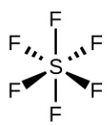
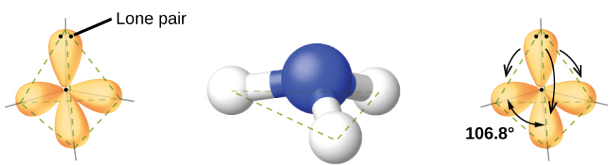
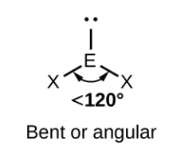
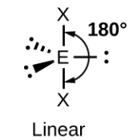
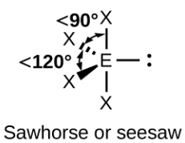
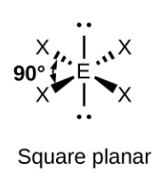

---

theme: "simple"
transition: "slide"
highlightTheme: "monokai"
slideNumber: true
title: "VSEPR Theory Presentation"

---

## Valence Shell Electron Pair Repulsion (VSEPR) Theory

### Ms. Danica Foerster

#### 04 Feb 2024

---

### Valence Shell Electron Pair Repulsion (VSEPR) Theory
 - Predict molecular structure
    - Bond angles
 - Easier and more intuitive than other bonding theories
 - Uses Lewis structure
    - Electrons in bonds or lone pairs

---

### Valence Shell Electron Pair Repulsion (VSEPR) Theory
 - Valence electrons want to minimize repulsions

 - Regions of electron density maximize distance
    - Bonds and lone pairs

---

### Valence Shell Electron Pair Repulsion (VSEPR) Theory
 1. Draw Lewis sturcture
 2. Count regions of electron density
 3. Determine electron geometry
 4. Determine molecular geometry

---

### Electron Density Regions

These are regions where electrons are either in
- bonds between atoms
    - multiple bonds count as one region
- lone pairs

---

### Electron Geometry

- Based on the number of electron density regions
    - multiple bonds count as one region
- Electron geometry determines molecular geometry

---

### Two regions of electron density

`\[\ce{BeF2}\]`

The farthest apart is opposite the central atom

- Electron geometry is **Linear**
- Angle is **180°**

---

### Three regions of electron density

`\[\ce{BH3}\]`

The farthest apart is a flat triangle

- Electron geometry is **Trigonal Planar**
- Angle is **120°** between all regions

---

### Four regions of electron density

`\[\ce{CH4}\]`

The farthest apart is a tetrahedron

- Electron geometry is **Tetrahedral**
- Angle is **109.5°** between all regions

---

### Five regions of electron density

The farthest apart is a two triangular pyramids
   
 - 3 Equatorial regions
    - Triangle
 - 2 Axial regions
    - Above and below triangle

---

### Five regions of electron density

`\[\ce{PF5}\]`

- Electron geometry is **Trigonal bipyramidal**
- Angle is 
    - **90°** between axial and equitorial regions
    - **120°** between equitorial regions
    - **180°** between axial regions

---

### Six regions of electron density

`\[\ce{SF6}\]`

The farthest apart is an octohedron

- Electron geometry is **Octahedral**
- Angle is 
    - **90°** between adjacent regions
    - **180°** between axial regions

---

<section>
<h3>Quick Quiz </h3>

What is the electron geometry of `\[\ce{NH3}\]`
<iframe src="https://embed.polleverywhere.com/multiple_choice_polls/RLxcObplfsXcc9JTWslem?controls=none&short_poll=true" width="800px" height="600px"></iframe>
</section>
<section>
<h3>Quick Quiz Answer</h3>
Tetrahedral  
The central atom in NH3 is N  
N has 3 bonds and 1 lone pair, thus 4 regions of electron density
</section>

---

### Molecular Structure

- Once we know the **electron geometry** around the central atom, then we can determine the **molecular structure**
- Based on the number of bonding regions
    - Easier to count lone pairs

---

### Molecular Structure

- If no lone pairs, the molecular geometry is the same as the electron geometry
- Bond angles are the same as the angles between electron density regions

---

### Molecular Structure

- If there is one or more lone pairs, then it is different
- Bond angles are less than the angles between electron density regions

---

### Molecular Structure

- This is because the repulsion between different types of electron pairs is different
- lone pairs (lp) have more repulsion than bonding pairs (bp)

lp-lp > lp-bp > bp-bp

---

### Molecular Structure

- also, the size of the electron region distorts the geometry as well
    - lone pairs occupy the most space
    - multiple bonds occupy more than single bonds

lone pair > triple bond > double bond > single bond

---

### Molecular Structure  
#### Linear Electron Geometry

- Only one possible molecular geometry
- Linear

---

### Molecular Structure  
#### Trigonal Planar Electron Geometry

- Two possible molecular geometries
    - No lone pairs: Trigonal Planar
    - 1 lone pair: Bent

---

### Molecular Structure  
#### Tetrahedral Electron Geometry

- Three possible molecular geometries
    - No lone pairs: Tetrahedral
    - 1 lone pair: Trigonal pyramid
    - 2 lone pairs: Bent

---

### Molecular Structure  
#### Trigonal Bipyramidal Electron Geometry

- Four possible molecular geometries
    - No lone pairs:  Trigonal Bipyramidal
    - Atoms favor the axial positions instead of equitorial position
    - 3 lone pairs: Linear

---

### Molecular Structure  
#### Trigonal Bipyramidal Electron Geometry

- Four possible molecular geometries
    - No lone pairs:  Trigonal Bipyramidal
    - 1 lone pair: Seesaw
    - 2 lone pair: T-shaped
    - 3 lone pairs: Linear

---

### Molecular Structure  
#### Octahedral Electron Geometry

- Five possible molecular geometries
    - No lone pairs:  Octahedral
    - 1 lone pair: Square pyramid
    - 2 lone pair: Square planar
    - 3 lone pairs: T-shaped
    - 4 lone pairs: Linear

---

### Practice

- `\[\ce{CO2}\]`
- `\[\ce{NH4+}\]`
- `\[\ce{H2O}\]`
- `\[\ce{SF4}\]`
- `\[\ce{XeF4}\]`

---
